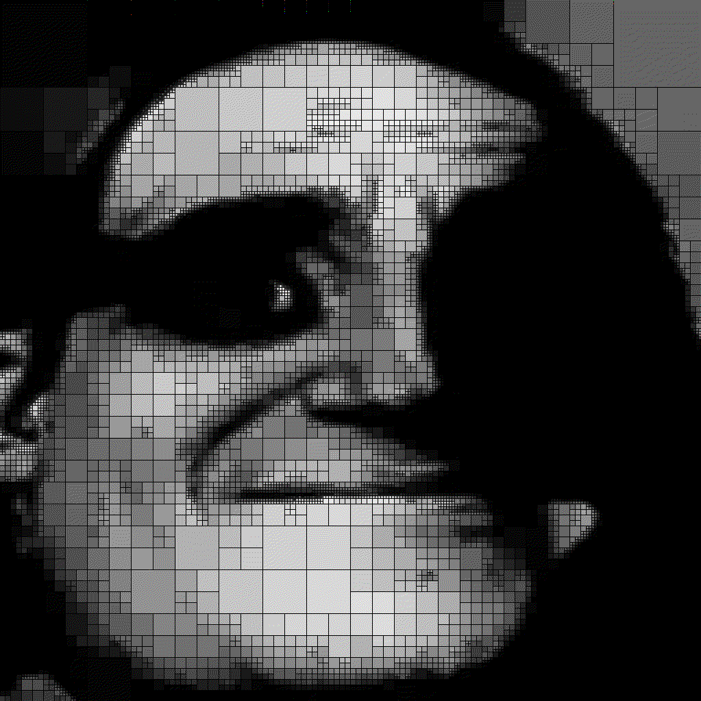

# Практическая работа №6 "Квадродеревья, октодеревья и *k*-d деревья"

Реализовать приложение с использованием квадродеревьев, октодеревьев или
*k*-d деревьев.

Приложение должно включать модуль с реализацией соответствующего дерева.
Дерево должно поддерживать следующие методы:
- вставка
- удаление
- вхождение в диапазон/область (для 2d)/объем (для 3d)

## Варианты:

Возможна реализация следующих приложений:
- Астероиды. Поиск столкновений на основе квадродеревьев:
- Сжатие изображений
- Поиск ближайшего объекта на карте

### Астероиды

Приложение, моделирующее полет объектов круглой формы и поиск столкновений
между объектами и между объектом и границей. Поиск столкновений должен быть
реализован на основе квадродеревьев. Полный перебор объектов **запрещается**.

Столкновения считать абсолютно упругими. Масса шаров равна их площади.

Предусмотреть:
1. Поиск столкновений через квадродеревья.
2. Визуализацию полета шаров.
3. Визуализацию границ дерева (в динамике).
4. Графический интерфейс для выбора:
    - количества шаров;
    - границ размеров шаров, сами размеры генерируются случайным образом в
    пределах этих границ;
    - размеры области;
    - границы скоростей, сами скорости генерируются случайным образом в
    пределах этих границ для каждого шара.
5. *Доработать программу до полноценной игры
[Астероиды](https://ru.wikipedia.org/wiki/Asteroids):
    - в центре разместить "космический корабль" в виде треугольника;
    - реализовать стрельбу по шарам-астероидам и разрушение последних;
    - при столкновении шара с кораблем, должна отниматься 1 жизнь;
    - конец игры при исчерпании всех жизней.

Допускается реализация как в 2d, так и в 3d пространстве.

Пример:

Подробнее см. видео https://www.youtube.com/watch?v=eED4bSkYCB8

### Сжатие изображений

Реализовать консольную утилиту (с помощью CLI, Command line interface) по
сжатию изображения с помощью квадродеревьев.

Предусмотреть:
1. Сжатие изображения с помощью квадродеревьев.
2. Сохранение итогового изображения.
3. Сохранение изображения с границами построенного дерева.
4. Указание степени сжатия.
5. Использование потоков для сжатия отдельных областей.
6. *Создание гифки пошагового сжатия любой картинки

Пример:

### Поиск ближайшего объекта на карте

Реализовать программу для поиска ближайшего объекта заданного типа на карте.
Поиск осуществлять с помощью *k*-d деревьев на основе евклидова расстояния.

Предусмотреть:
1. Способ выбора объектов нужного типа (магазин, кафе, и др.).
2. Способ выбора точки для которой нужно произвести поиск.
3. Способ выбора района поиска.
4. Поиск ближайшего объекта с помощью *k*-d деревьев.
5. Вывод данных о найденном объекте (адрес, расстояние от точки до объекта)
6. Визуализацию карты, объектов и точки.
7. *Реализация интерактивной карты.

Работать с картами необходимо через API открытых ресурсов, см. полезные
материалы.

Программа может быть как консольной, так и иметь графический интерфейс.

Для реализации карт в Pytohn см. ссылки:
- [Как сделать интерактивную карту с помощью Python и open source библиотек](https://habr.com/ru/company/skillfactory/blog/521840/)
- [How to show Folium map inside a PyQt5 GUI?](https://stackoverflow.com/questions/58590199/how-to-show-folium-map-inside-a-pyqt5-gui)
- [How to create widget in pyqt5 to show google map](https://stackoverflow.com/questions/53627316/how-to-create-widget-in-pyqt5-to-show-google-map)
- [How to include folium map into PyQt5 application window?](https://stackoverflow.com/questions/60437182/how-to-include-folium-map-into-pyqt5-application-window)

##  Требования к реализации

Программа должна быть оформлена в виде пакета, где реализация дерева должен
находиться в отдельном модуле с именем, например, `tree.py`.

Дерево должно быть реализованно в виде класса с соответствующими методами
операций и свойствами для доступа к атрибутам.

<!-- ## Входные и выходные данные -->

## Методика оценивания

Общие требования для всех вариантов:
    - код работы проходит проверку утилитой `pylint` с конфигурационным
    файлом `.pylintrc`.
    - код работы успешно проходит тесты, если таковые имеются.
    - наличие документации к модулям, функциям, классам и методам.
    - наличие аннотации типов.

**Вариант "Астероиды":**
1. На оценку 3 балла:
    - реализовать пункты 1, 2;
    - размеры шаров одинаковы;
    - область фиксирована.
2. На оценку 4 балла:
    - размеры шаров случайно генерируются из фиксированного диапазона;
    - дополнительно реализовать пункт 3.
3. На оценку 5 балла:
    - дополнительно реализовать пункт 4.
4. Плюс в карму:
    - пункт 5.

**Вариант "Сжатие изображений":**
1. На оценку 3 балла:
    - реализовать пункты 1, 2, 3, 4.
2. На оценку 5 балла:
    - дополнительно реализовать пункт 5.
3. Плюс в карму:
    - пункт 6.

**Вариант "Поиск ближайшего объекта на карте":**
1. На оценку 3 балла:
    - реализовать пункты 1, 2, 3, 4, 5.
2. На оценку 5 балла:
    - дополнительно реализовать пункт 6.
3. Плюс в карму:
    - пункт 7.

## Полезные материалы

- [Использование квадродеревьев при расчёте пробок 2ГИС](https://habr.com/ru/company/2gis/blog/205742/)
- [Использование матричных квадродеревьев для хранения площадных картографических объектов](http://www.swsys.ru/index.php?page=article&id=632)
- [Деревья квадрантов и распознавание коллизий](https://habr.com/ru/post/473066/)
- [Quadtree](https://en.wikipedia.org/wiki/Quadtree)
- [*k*-d tree](https://en.wikipedia.org/wiki/K-d_tree)
- [https://en.wikipedia.org/wiki/Octree](https://en.wikipedia.org/wiki/Octree/)
- [Using D3 Quadtrees to Power An Interactive Map for Bonnier Corporation](https://www.phase2technology.com/blog/using-d3-quadtrees)
- [Получаем данные Open Street Map в Python](https://nuancesprog.ru/p/6248/)
- [How To Efficiently Display Large Amounts of Data on iOS Maps](https://thoughtbot.com/blog/how-to-handle-large-amounts-of-data-on-maps)
- [Transform an image into a Quadtree](https://medium.com/analytics-vidhya/transform-an-image-into-a-quadtree-39b3aa6e019a)
- [Pygame how to let balls collide](https://stackoverflow.com/questions/63145493/pygame-how-to-let-balls-collide)
- [Collision detection](https://en.wikipedia.org/wiki/Collision_detection)
