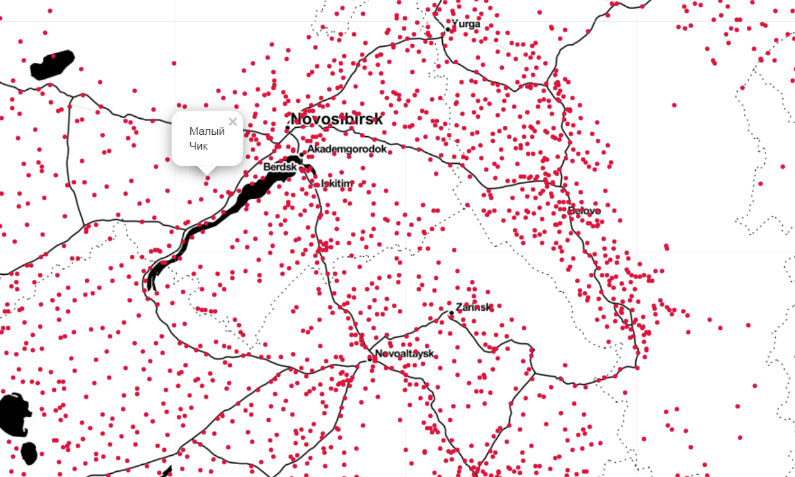

# Практическая работа №8 "Задача коммивояжера"

Разработать алгоритм решения задачи коммивояжера.

Испытать свой алгоритм на населенных пунктах
[Сибирского Федерального Округа](https://ru.wikipedia.org/wiki/%D0%A1%D0%B8%D0%B1%D0%B8%D1%80%D1%81%D0%BA%D0%B8%D0%B9_%D1%84%D0%B5%D0%B4%D0%B5%D1%80%D0%B0%D0%BB%D1%8C%D0%BD%D1%8B%D0%B9_%D0%BE%D0%BA%D1%80%D1%83%D0%B3).

Рассматриваются только города, села, деревни и поселки. Всего 9629
населенных пунктов.

Ссылка на соревнование: **Coming soon**




## Алгоритмы:

Разрешены любые способы решения задачи коммивояжера, например:
- Муравьиный алгоритм
- Генетический алгоритм
- Рой частиц
- Гравитационный поиск
- Метод ветвей и границ
- и другие

##  Требования к реализации

Алгоритм должен быть реализован в виде универсальной функции
(подходящей не только для решения задачи коммивояжера).

Расстояние между населенными пунктами рассчитывается как
[евклидово расстояние](https://en.wikipedia.org/wiki/Norm_(mathematics)#Euclidean_norm)
между точками.

## Входные и выходные данные

В качестве данных используется населенные пункты типа "город", "село",
"деревня", "поселок" Сибирского Федерального Округа с населением более
100 человек. Набор данных из 6145 населенных пунктов вы найдете в файле
`data.csv`. Его структура состоит из следующих столбцов:
- `id` - порядковый номер (целое число)
- `region` - Регион (строка с пробелами)
- `municipality` - Муниципальный район (строка с пробелами)
- `settlement` - Наименование населенного пункта (строка с пробелами)
- `type` - тип: `г` - город, `с` - село, `п` - поселок, `д` - деревня
(строка)
- `latitude_dd` - десятичное представление географических координат
широты (целое число)
- `longitude_dd` - десятичное представление географических координат
долготы (целое число)

`latitude_dd` и `longitude_dd` это целые числа полученные путем
умножения исходного значения на 100 и последующего округления до
ближайшего целого. Для преобразования в исходное значение (например, для
нанесения на карту) достаточно поделить на 100.

Пунктом отправления считать Красноярск, в `data.csv` его `id` равен `3756`.

Первые 5 строк файла `data.csv`:

```csv
id;region;municipality;settlement;type;latitude_dd;longitude_dd
0;Республика Алтай;Шебалинский район;Каспа;с;5111;8601
1;Алтайский край;Смоленский;Молочный;п;5241;8497
2;Красноярский край;Казачинский район;Отношка;с;5738;9270
3;Республика Тыва;Каа-Хемский кожуун;Кундустуг;с;5157;9518
```

Пример визуализации набора данных приведен в файле `analysis.ipynb`.
Для его запуска вам потребуется установить библиотеки `pandas` и `folium`.

Выходными данными должен быть файл с расстояниями между населенными
пунктами в порядке их прохождения. Например, если первая поездка должна
быть из Красноярска с координатами `(5601;9285)` в Петропавловку с
координатами `(5661;9621)`, то результирующий файл `solution.csv` должен
содержать строку `0;341.3151036798694`. Таким образом, для 6145
населенных пунктов должно получиться 6144 расстояния. Расстояние между
населенными пунктами рассчитывается как евклидово расстояние между точками.


## Полезные материалы

- [Задача коммивояжёра](https://ru.wikipedia.org/wiki/%D0%97%D0%B0%D0%B4%D0%B0%D1%87%D0%B0_%D0%BA%D0%BE%D0%BC%D0%BC%D0%B8%D0%B2%D0%BE%D1%8F%D0%B6%D1%91%D1%80%D0%B0)
- [TSPLIB](http://comopt.ifi.uni-heidelberg.de/software/TSPLIB95/)
- [Solving The Travelling Salesman Problem (TSP) For Deliveries](https://blog.routific.com/travelling-salesman-problem)
- [Solving the Large-Scale TSP Problem in 1 h: Santa Claus Challenge 2020](https://www.frontiersin.org/articles/10.3389/frobt.2021.689908/full)
- [Santa Claus TSP Challenge 2020](https://cs.uef.fi/sipu/santa/)
- [Traveling Salesperson Problem with OR-Tools](https://developers.google.com/optimization/routing/tsp)
- [Mona Lisa TSP Challenge](https://www.math.uwaterloo.ca/tsp/data/ml/monalisa.html)
- [The Traveling Salesman Problem](https://www.math.uwaterloo.ca/tsp/index.html)
- [Traveling Santa Problem Kaggle Challenge](https://www.kaggle.com/c/traveling-santa-problem/overview)
- [TSPLIB 95](http://comopt.ifi.uni-heidelberg.de/software/TSPLIB95/tsp95.pdf)
- [Датасеты для задачи коммивояжера](http://comopt.ifi.uni-heidelberg.de/software/TSPLIB95/tsp/)
- [Оптимальные маршруты для существующих датасетов](http://www.math.uwaterloo.ca/tsp/optimal/index.html)
- [История задачи коммивояжера](http://www.math.uwaterloo.ca/tsp/us/history.html)
- [Traveling Santa Problem, пример наивного метода](https://www.kaggle.com/javiabellan/starting-kernel-plotting-nearest-neighbor)
